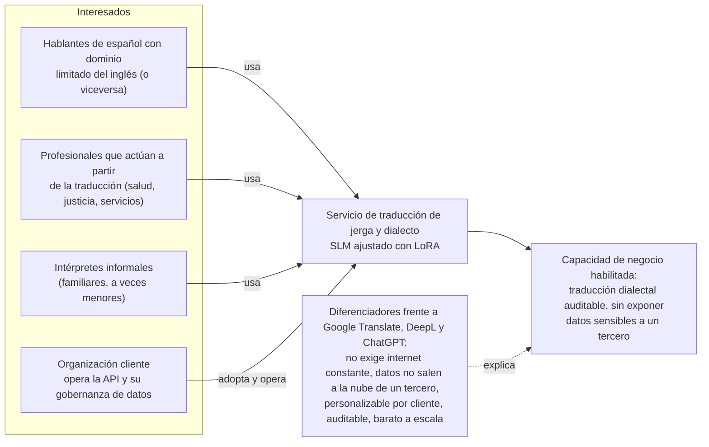
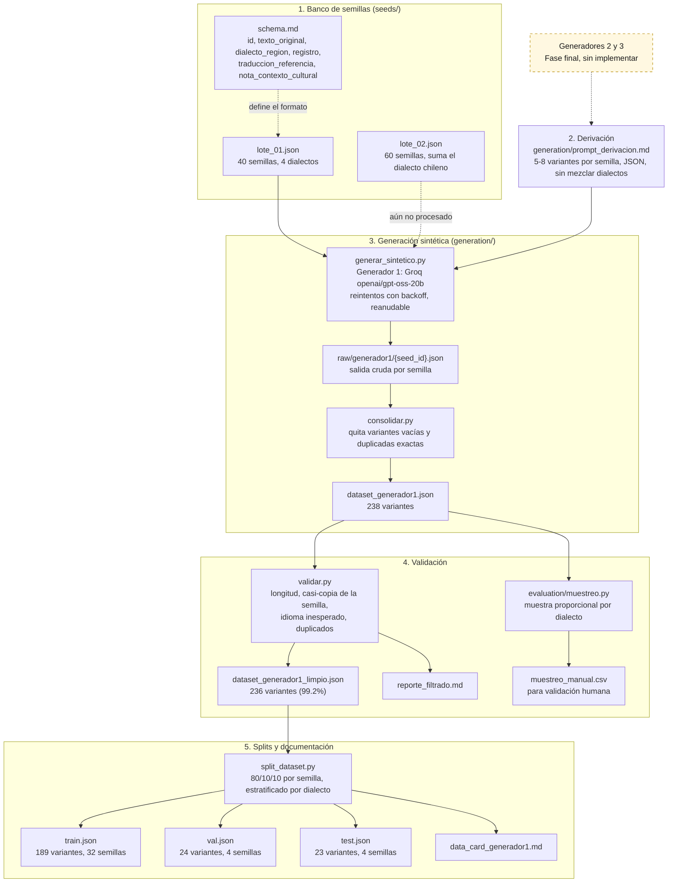
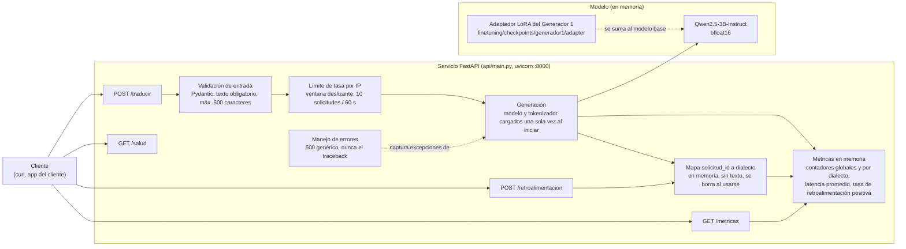
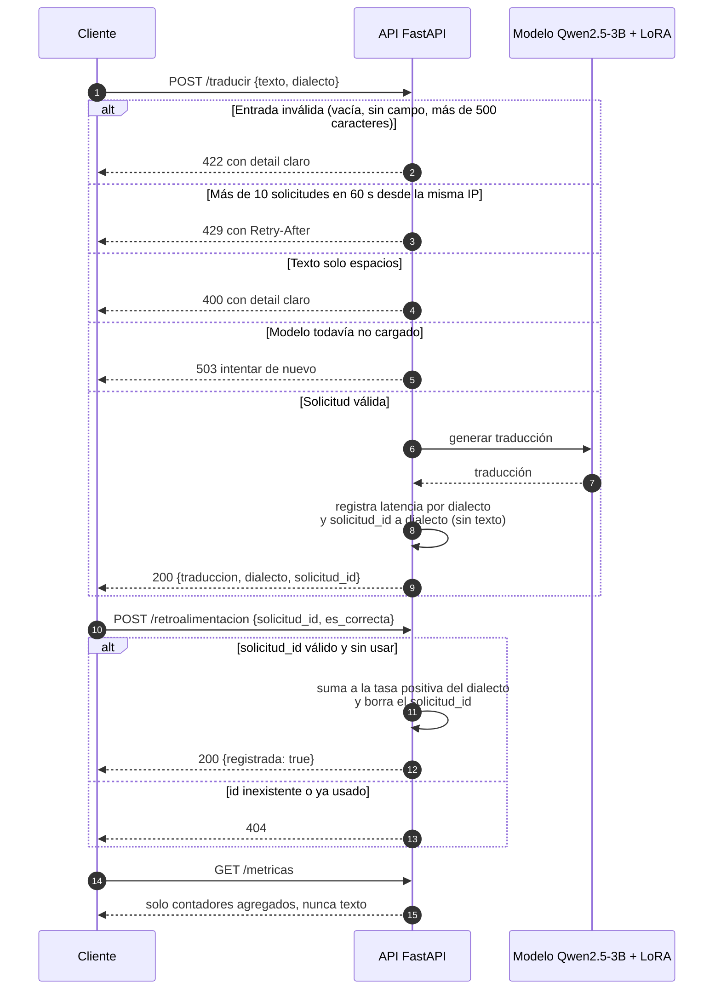
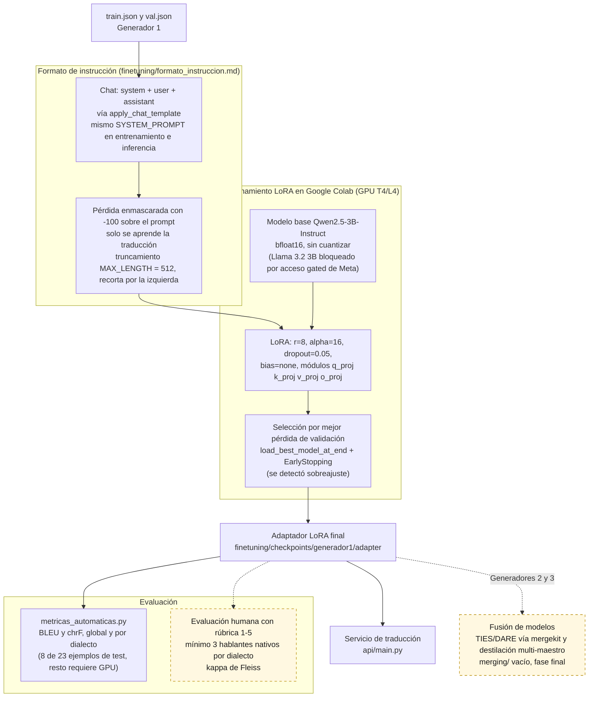
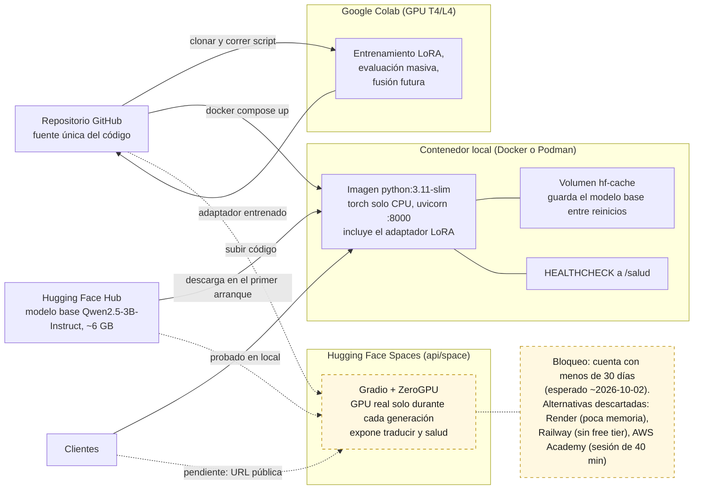
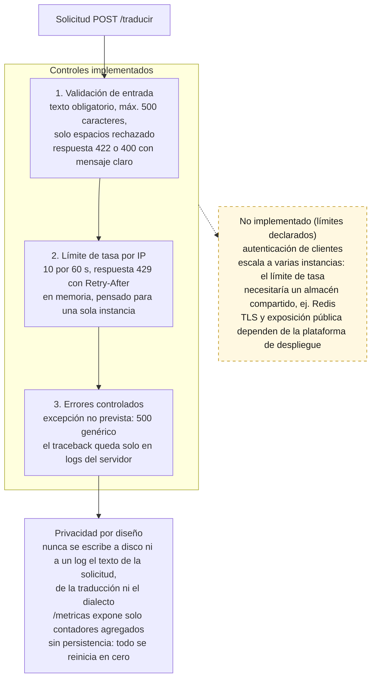
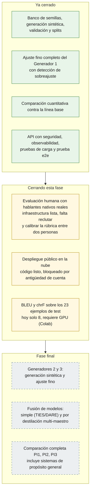
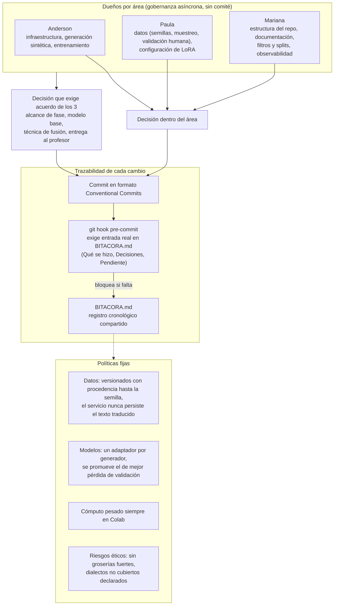

# Diagramas de arquitectura (Project Advance 2)

Diagramas para los entregables del syllabus de la semana 10:
arquitectura empresarial, de datos, de aplicación y de tecnología,
diseño del componente inteligente, diseño de la API, plan de
despliegue en la nube, diseño de seguridad, hoja de ruta y modelo de
gobernanza.

Cómo leerlos:

- Cada elemento sale del código o de la documentación real del repo
  (se indica el archivo cuando ayuda). No hay componentes inventados.
- **Línea punteada y fondo amarillo = pendiente o no implementado.**
- Notación libre (no C4 ni UML formal), porque el syllabus no dice
  cuál se espera. Si el profesor pide una notación específica, hay
  que redibujarlos.
- Se ven renderizados en GitHub y en la vista previa de VS Code
  (con la extensión Markdown Preview Mermaid Support). El código
  fuente de cada diagrama queda dentro de su bloque `mermaid`.
- Los escenarios de atributos de calidad no llevan diagrama: ya son
  una tabla formal en `paper/main.tex` (estímulo, entorno, respuesta,
  medida).

---

## 1. Arquitectura empresarial

Interesados, capacidad de negocio y diferenciadores. Contenido de la
Sección de Caracterización del problema y de la Tabla de diferencias
de producto del paper.

---

## 2. Arquitectura de datos

Pipeline de datos con los scripts y archivos reales de `seeds/`,
`generation/` y `evaluation/`. Solo el Generador 1 (Groq) está
implementado; los Generadores 2 y 3 son fase final.

---

## 3. Arquitectura de aplicación

Componentes internos del servicio `api/main.py` (FastAPI) y el orden
en que una solicitud los atraviesa. Todo el estado vive en memoria del
proceso: no hay base de datos ni escritura a disco.

---

## 4. Diseño de la API

Contrato de los cuatro endpoints y secuencia de una traducción con su
retroalimentación. Detalle completo en `api/README.md`.

| Endpoint | Entrada | Salida correcta | Errores posibles | Límite de tasa |
|---|---|---|---|---|
| `GET /salud` | ninguna | `{"estado": "ok"}` | ninguno | No |
| `GET /metricas` | ninguna | contadores globales y `por_dialecto` (latencia promedio, tasa de retroalimentación positiva) | ninguno | No |
| `POST /traducir` | `{"texto": "...", "dialecto": "opcional"}` | `{"traduccion", "dialecto", "solicitud_id"}` | `422` entrada inválida, `429` límite de tasa (con `Retry-After`), `400` solo espacios, `503` modelo no cargado, `500` error interno genérico | Sí, 10 por 60 s por IP |
| `POST /retroalimentacion` | `{"solicitud_id": "...", "es_correcta": true/false}` | `{"registrada": true}` | `404` id inexistente o ya usado | No |

---

## 5. Arquitectura de tecnología y diseño del componente inteligente

Ciclo de vida del modelo: de los splits al adaptador que sirve la API.
El entrenamiento corre en Google Colab (política del repo: cómputo
pesado nunca en máquina local).

---

## 6. Plan de despliegue en la nube

Tres entornos. El contenedor local ya funciona; el despliegue público
en Hugging Face Spaces tiene el código listo pero está bloqueado por
un requisito externo (antigüedad de 30 días de la cuenta para la
excepción gratuita de ZeroGPU, esperada alrededor del 2026-10-02).
Pasos de despliegue en `docs/despliegue.md`.

---

## 7. Diseño de seguridad

Controles sobre el recorrido de una solicitud, y lo que el servicio no
hace. Las cifras salen de `api/README.md` y de las pruebas de la
Sesión 28.

---

## 8. Hoja de ruta

Estado a la fecha, según la Tabla de hoja de ruta del paper.

---

## 9. Modelo de gobernanza

Roles, decisiones y trazabilidad. Detalle en
`docs/modelo_gobernanza.md`.

